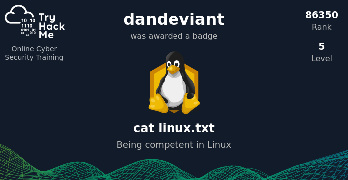

# Basic Linux Commands
---
System Commands
- [[Directory Manipulation (Beginner)]]
- [[Directory manipulation (Advanced)]]
- [[Linux User Management]]

---
Aplication and Services Commands
- [[Git CLI using Shell]]

Other Links

- [[(Main) Tools You Can Learn]]

